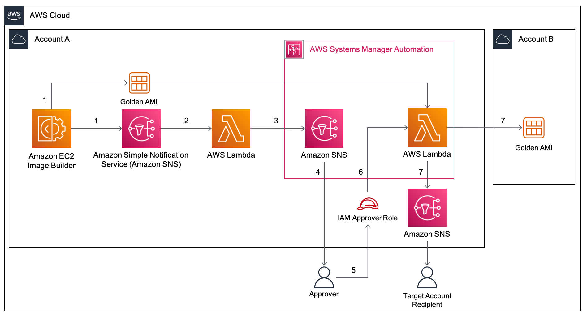

# EC2 Image Builder send approval notifications before sharing AMIs

## Introduction

You may be required to manually validate the [Amazon Machine Image (AMI)](https://docs.aws.amazon.com/AWSEC2/latest/UserGuide/AMIs.html) built from an [Amazon Elastic Compute Cloud (Amazon EC2)](https://aws.amazon.com/ec2/) Image Builder pipeline before sharing this AMI to other AWS accounts or to an AWS organization. Currently, Image Builder provides an end-to-end pipeline that automatically shares AMIs after they’ve been built.

In this post, we will walk through the steps to enable approval notifications before AMIs are shared with other AWS accounts. Image Builder supports automated [image testing](https://docs.aws.amazon.com/imagebuilder/latest/userguide/how-image-builder-works.html) using test components. The recommended best practice is to automate test steps, however situations can arise where test steps become either challenging to automate or internal compliance policies mandate manual checks be conducted prior to distributing images. In such situations, having a manual approval step is useful if you would like to verify the AMI configuration before it is shared to other AWS accounts or an AWS Organization. A manual approval step reduces the potential for sharing an incorrectly configured AMI with other teams which can lead to downstream issues. This solution sends an email with a link to approve or reject the AMI. Users approve the AMI after they’ve verified that it is built according to specifications. Upon approving the AMI, the solution automatically shares it with the specified AWS accounts.



## Deploying the solution

This solution deploys the following components:

* Image Builder related resources

  * An Image Builder pipeline that builds an AMI from the latest Amazon Linux 2 image and installs the Amazon CloudWatch Agent on it.
  * An Amazon SNS Topic that the Image Builder pipeline publishes to. A Lambda Function subscribes to ths topic.

* Networking resources for the EC2 instance launched by Image Builder

  * An Amazon VPC with one public subnet.

* Start Automation Execution Lambda Function and SNS topic

  * An AWS Lambda function subscribed to the SNS topic that Image Builder publishes to. This Lambda function retrieves the AMI ID and Name and starts the Automation execution.

* Aautomation Document and SNS topic

  * An AWS Systems Manager Automation Document that contains 2 steps. The first step is a manual approval step. The second step is a Lambda invocation step that shares the AMI.
  * An Amazon SNS Topic that the Automation above publishes to. This topic has email subscribers.
  * An AWS Identity and Access Management (IAM) role to grant the Automation Document permissions to publish to the SNS topic.

* Approver IAM Role

  * An IAM Role that has the minimum permissions required to approve the Systems Manager Approval step. This role has a trust policy allowing a specified IAM principal to assume it.

* Share AMI Lambda Function

  * AWS Lambda function that shares the AMI to the target accounts and publishes to another SNS topic, notifying email subscribers that the AMI has been shared.
  * An Amazon SNS Topic that the Lambda Function above publishes to. This topic has email subscribers.
  * An IAM role to grant the AWS Lambda function permissions to publish to the SNS topic and modify image attributes.

### Requirements

- Two AWS accounts – one to host solution resources, and the second with which to share the built AMI.

    - In the account that hosts the solution, prepare an IAM principal with the `sts:AssumeRole` permission. This principal must assume the IAM Role that is listed as an approver in the Systems Manager approval step. The ARN of this IAM principal is specified in the AWS CloudFormation `IAMPrincipalAssumeRoleARN` parameter, This ARN is added to the trust policy of approval IAM Role.
    - In addition, in the account hosting the solution, ensure that the IAM principal deploying the CloudFormation template has the required permissions to create the resources in the stack.

-	A new Amazon Virtual Private Cloud (Amazon VPC) will be created from the stack. Make sure that you have fewer than five VPCs in the selected Region.

### Deployment Steps

The template that deploys the solution can be found at [template.yaml](./template.yaml).

If you're using the AWS Console, follow the instructions at [AWS CloudFormation documentation: Creating a stack on the AWS CloudFormation console](https://docs.aws.amazon.com/AWSCloudFormation/latest/UserGuide/cfn-console-create-stack.html).

If you're using the AWS CLI, follow the instructions at [AWS CloudFormation documentation: Using the AWS Command Line Interface](https://docs.aws.amazon.com/AWSCloudFormation/latest/UserGuide/cfn-using-cli.html). For a sample command, run the following, replacing the parameters accordingly. You can also override additional parameters.

```bash
aws cloudformation deploy \
  --template-file ./template.yaml \
  --stack-name ec2-image-builder-approver-notifications \
  --parameter-overrides ApproverEmail=<REPLACE_WITH_EMAIL_ADDRESS> IAMPrincipalAssumeRoleARN=<REPLACE_WITH_IAM_PRINCIPAL_ARN> TargetAccountEmail=<REPLACE_WITH_EMAIL_ADDRESS> TargetAccountIds=<REPLACE_WITH_ACCOUNT_ID> LambdaCloudWatchLogGroupRetentionInDays=<REPLACE_WITH_VALID_DAYS>
# Example below where the IAMPrincipalAssumeRoleARN is the ARN belonging to an AWS IAM Identity Center (successor to AWS Single Sign-On) Federated User
aws cloudformation deploy \
  --template-file ./template.yaml \
  --stack-name ec2-image-builder-approver-notifications \
  --parameter-overrides ApproverEmail=example1@example.com IAMPrincipalAssumeRoleARN=arn:aws:sts::123456789012:assumed-role/example/example TargetAccountEmail=example2@example.com TargetAccountIds=987654321012 LambdaCloudWatchLogGroupRetentionInDays=30
```

After the stack is deployed, make sure to confirm the the SNS Topic Subscription Email sent to the `ApproverEmail` and `TargetAccountEmail` specified.

## Testing the solution

Follow the instructions at [the blog page](https://aws.amazon.com/blogs/compute/adding-approval-notifications-to-ec2-image-builder-before-sharing-amis/) to test the solution.

## Clean up

Once you're done, you can delete the solution by navigating to the [AWS CloudFormation console](https://console.aws.amazon.com/cloudformation/home?#/stacks/), selecting the stack and choosing `Delete`.

In addition, don't forget to delete the following artefacts too:

* Deregister the AMIs that were created and shared.

## Cost of the solution

The cost of the solution is covered completely by the free tier if your account is less than 12 months old (and you don't already exceed free tier limits like the 750 t3.micro hours monthly). Otherwise, the cost of testing the solution is less than $0.25 if running for an hour. Costs break-down below:

* By default, this solution uses t3.micro instances, which cost $0.0104 / hour each in us-east-1. You can find all regions pricing [here](https://aws.amazon.com/ec2/pricing/on-demand/). t3.micro is eligible for [AWS Free tier](https://aws.amazon.com/free/?all-free-tier.sort-by=item.additionalFields.SortRank&all-free-tier.sort-order=asc)
* There is no extra charge for EC2 Image Builder, you only pay for the underlying EC2 resources. By default, this solution uses t3.micro instances to build AMIs.
* There are no charges for SNS Lambda notifications. If you subscribe your e-mail to the SNS topic, the first 1,000 notifications are free. More details [here](https://aws.amazon.com/sns/pricing/)
* AWS Lambda first 1 Million requests per month are covered by the [AWS Free tier](https://aws.amazon.com/free/?all-free-tier.sort-by=item.additionalFields.SortRank&all-free-tier.sort-order=asc).
* AWS Systems Manager Automation has a free tier of 100,000 steps per account per month. More info [here in the Automation section](https://aws.amazon.com/systems-manager/pricing/).
* Cloudwatch Logs usage is covered by the free tier if you use less than 5GB of data. More info [here](https://aws.amazon.com/cloudwatch/pricing/).

## References

We invite you to experiment with different AMIs created using Image Builder, and with different Image Builder components.

* Check out this [GitHub repository for various examples that use Image Builder](https://github.com/aws-samples/amazon-ec2-image-builder-samples).
* Check out this [Solution on EC2 Auto Scaling Instance Refresh](https://github.com/aws-samples/ec2-auto-scaling-instance-refresh-sample).

## Security

See [CONTRIBUTING](CONTRIBUTING.md#security-issue-notifications) for more information.

## License

This library is licensed under the MIT-0 License. See the LICENSE file.
