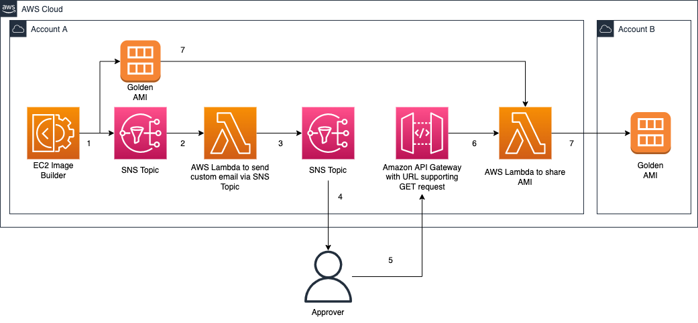

# EC2 Image Builder send approval notifications before sharing AMIs

## Introduction

In some situations, you may be required to manually validate the [Amazon Machine Image (AMI)](https://docs.aws.amazon.com/AWSEC2/latest/UserGuide/AMIs.html) built from an [Amazon Elastic Compute Cloud (Amazon EC2)](https://aws.amazon.com/ec2/) Image Builder pipeline before sharing this AMI to other AWS accounts or to an AWS Organization. Currently, Image Builder provides an end-to-end pipeline that automatically shares AMIs after they’ve been built.

In this post, we will walk through the steps to enable approval notifications before AMIs are shared with other AWS accounts. Having a manual approval step could be useful if you would like to verify the AMI configurations before it is shared to other AWS accounts or an AWS Organization. This reduces the possibility of incorrectly configured AMIs being shared to other teams which in turn could lead to downstream issues if applications are installed using this AMI. This solution uses serverless resources to send an email with a link that automatically shares the AMI with the specified AWS accounts. Users select this link after they’ve verified that the AMI is built according to specifications.



## Deploying the solution

This solution deploys the following components:

* Image Builder related resources

  * An Image Builder pipeline that builds an AMI from the latest Amazon Linux 2 image and installs the Amazon CloudWatch Agent on it
  * An Amazon SNS Topic that receives notifications from the Image Builder pipeline. Note that the send approval AWS Lambda Function subscribes to this SNS topic.

* Networking resources for the EC2 instance launched by Image Builder

  * An Amazon VPC with one public subnet

* Send approval email Lambda Function and SNS topic

  * An AWS Lambda function subscribed to the SNS topic that Image Builder publishes to. This Lambda function retrieves the AMI ID and publishes to another SNS topic, notifying email subscribers that the AMI has been created.
  * An Amazon SNS Topic that the Lambda Function above publishes to. This topic has email subscribers.
  * An IAM role to grant the AWS Lambda function permissions to publish to the SNS topic.

* Share AMI Lambda Function and Amazon API Gateway

  * An API Gateway API that triggers the Lambda Function upon a GET request by the user
  * AWS Lambda function that shares the AMI to the target accounts and publishes to another SNS topic, notifying email subscribers that the AMI has been shared.
  * An Amazon SNS Topic that the Lambda Function above publishes to. This topic has email subscribers.
  * An IAM role to grant the AWS Lambda function permissions to publish to the SNS topic and modify image attributes.

### Requirements

**Note:** For easiest deployment you can create a [Cloud9 environment](https://docs.aws.amazon.com/cloud9/latest/user-guide/create-environment.html), it already has the below requirements installed.

* [AWS CLI](https://docs.aws.amazon.com/cli/latest/userguide/install-cliv2.html)
* [Python 3 installed](https://www.python.org/downloads/)
* [SAM CLI installed](https://docs.aws.amazon.com/serverless-application-model/latest/developerguide/serverless-sam-cli-install.html)

### Deployment Steps

Once you've installed the requirements listed above, open a terminal session as you'll need to run the `sam deploy` command to deploy the solution.

```bash
sam deploy \
    --template-file template.yaml \
    --stack-name ec2-image-builder-approver-notifications \
    --capabilities CAPABILITY_IAM \
    --resolve-s3 \
    --parameter-overrides \
    ApproverEmail=<String> \
    TargetAccountEmail=<String> \
    TargetAccountIds=<CommaDelimitedList>

# Example
sam deploy \
    --template-file template.yaml \
    --stack-name ec2-image-builder-approver-notifications \
    --capabilities CAPABILITY_IAM \
    --resolve-s3 \
    --parameter-overrides \
    ApproverEmail="exampleapprover@example.com" \
    TargetAccountEmail="exampletarget@example.com" \
    TargetAccountIds="123456789123,987654321987"
```

You will find all the resources created on the [AWS CloudFormation console](https://console.aws.amazon.com/cloudformation/home?#/stacks/).

Make sure to confirm the the SNS Topic Subscription Email sent to the `ApproverEmail` and `TargetAccountEmail` specified.

## Testing the solution

Follow the instructions at [Blog](TODO: Insert blog URL) to test the solution.

## Clean up

Once you're done, you can delete the solution by running the following command

```
sam delete --stack-name ec2-image-builder-approver-notifications --no-prompts --region <region>
```

In addition, don't forget to delete the following artifacts too:

* Derregister the AMI id that was created by Image Builder.
* Delete the [CloudWatch log groups](https://console.aws.amazon.com/cloudwatch/home#logsV2:log-groups) for the Lambda functions. You'll identify it with the name `/aws/lambda/ec2-image-builder-approve*`.
* Consider deleting the Amazon S3 bucket used to store the packaged Lambda artifact.

## Cost of the solution

The cost of the solution is covered completely by the free tier if your account is less than 12 months old (and you don't already exceed free tier limits like the 750 t3.micro hours monthly). Otherwise, the cost of testing the solution is less than $0.25 if running for an hour. Costs break-down below:
* By default, this solution uses t3.micro instances, which cost $0.0104 / hour each in us-east-1. You can find all regions pricing [here](https://aws.amazon.com/ec2/pricing/on-demand/). t3.micro is eligible for [AWS Free tier](https://aws.amazon.com/free/?all-free-tier.sort-by=item.additionalFields.SortRank&all-free-tier.sort-order=asc)
* There is no extra charge for EC2 Image Builder, you only pay for the underlying EC2 resources. By default, this solution uses t3.micro instances to build AMIs.
* There are no charges for SNS Lambda notifications. If you subscribe your e-mail to the SNS topic, the first 1,000 notifications are free. More details [here](https://aws.amazon.com/sns/pricing/)
* AWS Lambda first 1 Million requests per month are covered by the [AWS Free tier](https://aws.amazon.com/free/?all-free-tier.sort-by=item.additionalFields.SortRank&all-free-tier.sort-order=asc).
* Amazon API Gateway free tier includes one million API calls received for REST APIs. You can find additional information about pricing [here](https://aws.amazon.com/api-gateway/pricing/).
* Cloudwatch Logs usage is covered by the free tier if you use less than 5GB of data. More info [here](https://aws.amazon.com/cloudwatch/pricing/).

## Security

See [CONTRIBUTING](CONTRIBUTING.md#security-issue-notifications) for more information.

## License

This library is licensed under the MIT-0 License. See the LICENSE file.

